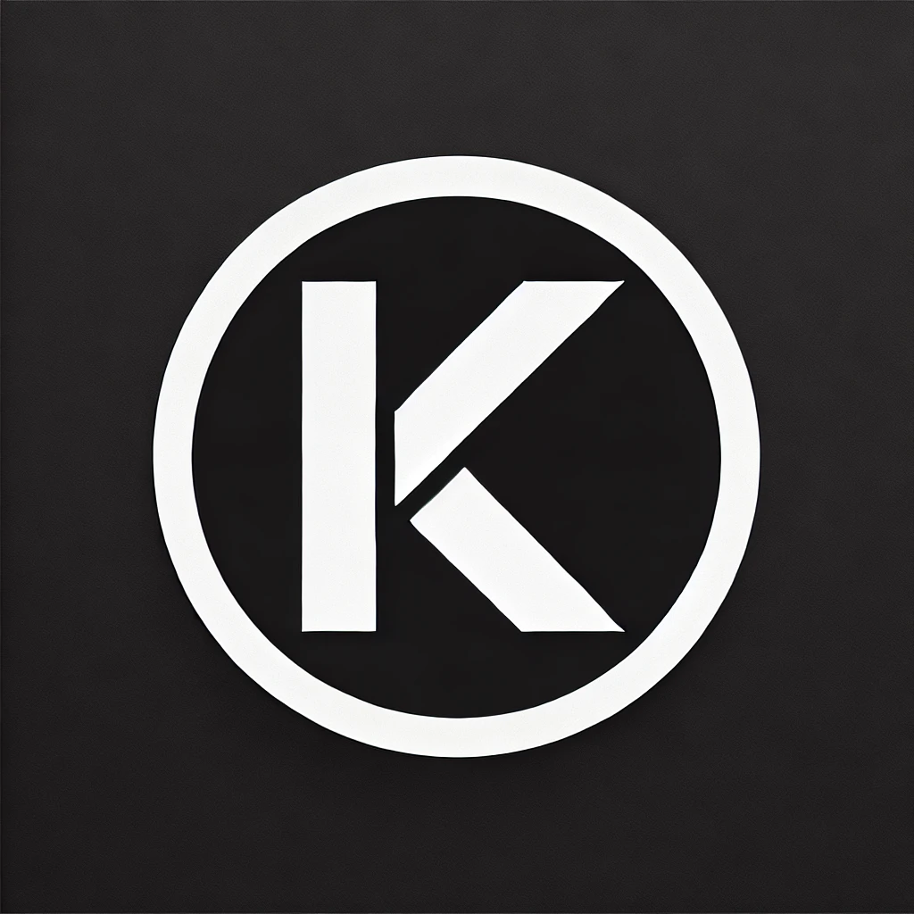

## Hi, I'm Khadondev👋

<details>
  <summary>📜 About Me</summary>

```javascript
class KhadonDev {
  constructor() {
    this.school = "UIT 😎";
    this.pronouns = "he/him";
    this.hobbies = ["Coding", "Programming", "Music", "Youtube"];
    this.programmingLanguages = ["JavaScript", "TypeScript"];
  }
}
```

</details>
<a href="#" target="_blank">

</a>

<h2 align="center">🛠 Technologies and Tools 🛠</h2>
<br>
<!-- https://simpleicons.org/ -->
<span></span>
&nbsp;
<span></span>
&nbsp;
<span></span>
&nbsp;
<span></span>
&nbsp;
<span></span>
&nbsp;
<span></span>
&nbsp;
<span></span>
&nbsp;
<span></span>
&nbsp;
<span></span>
&nbsp;
<span></span>
&nbsp;
<span></span>
&nbsp;
<span></span>
&nbsp;
<span></span>
&nbsp;
<span></span>
&nbsp;
<span></span>
&nbsp;
<span></span>
&nbsp;
<span></span>
&nbsp;
<br>
<h2 align="center">🤗Contact with me👋</h2>
<br>
<div align="left">
 <a href="https://khadon.io.vn" target="blank">
    
  </a>
   <a href="https://www.linkedin.com/in/kha-nguyen1301" target="blank">
    
  </a>
</div>
